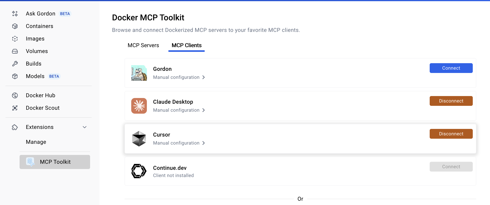

# EDA Tools MCP Server

A comprehensive Model Context Protocol (MCP) server that provides Electronic Design Automation (EDA) tools integration for AI assistants like Claude Desktop and Cursor IDE. This server enables AI to perform Verilog synthesis, simulation, ASIC design flows, and waveform analysis through a unified interface.

- **Paper Link**: [MCP4EDA: LLM-Powered Model Context Protocol RTL-to-GDSII Automation with Backend Aware Synthesis Optimization](https://arxiv.org/abs/2507.19570)

## Demo

https://github.com/user-attachments/assets/65d8027e-7366-49b5-8f11-0430c1d1d3d6

*EDA MCP Server demonstration showing Verilog synthesis, simulation, and ASIC design flow*

## Features

- **Verilog Synthesis**: Synthesize Verilog code using Yosys for various FPGA targets (generic, ice40, xilinx)
- **Verilog Simulation**: Simulate designs using Icarus Verilog with automated testbench execution
- **Waveform Viewing**: Launch GTKWave for VCD file visualization and signal analysis
- **ASIC Design Flow**: Complete RTL-to-GDSII flow using OpenLane with Docker integration
- **Layout Viewing**: Open GDSII files in KLayout for physical design inspection
- **Report Analysis**: Read and analyze OpenLane reports for PPA metrics and design quality assessment


## Prerequisites

Before using this MCP server, you need to install the following EDA tools:

### 1. Yosys (Verilog Synthesis)

**macOS (Homebrew):**
```bash
brew install yosys
```

**Ubuntu/Debian:**
```bash
sudo apt-get update
sudo apt-get install yosys
```


## Cite
```bibtex
@misc{wang2025mcp4edallmpoweredmodelcontext,
      title={MCP4EDA: LLM-Powered Model Context Protocol RTL-to-GDSII Automation with Backend Aware Synthesis Optimization}, 
      author={Yiting Wang and Wanghao Ye and Yexiao He and Yiran Chen and Gang Qu and Ang Li},
      year={2025},
      eprint={2507.19570},
      archivePrefix={arXiv},
      primaryClass={cs.AR},
      url={https://arxiv.org/abs/2507.19570}, 
}
```

**From Source:**
```bash
# Install prerequisites
sudo apt-get install build-essential clang bison flex \
    libreadline-dev gawk tcl-dev libffi-dev git \
    graphviz xdot pkg-config python3 libboost-system-dev \
    libboost-python-dev libboost-filesystem-dev zlib1g-dev

# Clone and build
git clone https://github.com/YosysHQ/yosys.git
cd yosys
make -j$(nproc)
sudo make install
```

**Alternative - OSS CAD Suite (Recommended):**
Download the complete toolchain from: https://github.com/YosysHQ/oss-cad-suite-build/releases

### 2. Icarus Verilog (Simulation)

**macOS (Homebrew):**
```bash
brew install icarus-verilog
```

**Ubuntu/Debian:**
```bash
sudo apt-get install iverilog
```

**Windows:**
Download installer from: https://bleyer.org/icarus/

### 3. GTKWave (Waveform Viewer)

**Direct Downloads (Recommended):**
- **Windows:** Download from [SourceForge](https://sourceforge.net/projects/gtkwave/)
- **macOS:** Download from [SourceForge](https://sourceforge.net/projects/gtkwave/) or use Homebrew: `brew install --cask gtkwave`
- **Linux:** Download from [SourceForge](https://sourceforge.net/projects/gtkwave/) or use package manager: `sudo apt-get install gtkwave`

**Alternative Installation Methods:**
```bash
# macOS (Homebrew)
brew install --cask gtkwave

# Ubuntu/Debian
sudo apt-get install gtkwave

# Build from source (all platforms)
git clone https://github.com/gtkwave/gtkwave.git
cd gtkwave
meson setup build && cd build && meson install
```

### 4. Docker Desktop (Recommended for OpenLane)

**Direct Downloads:**
- **Windows:** [Download Docker Desktop for Windows](https://www.docker.com/products/docker-desktop)
- **macOS:** [Download Docker Desktop for Mac](https://www.docker.com/products/docker-desktop) or `brew install --cask docker`
- **Linux:** [Download Docker Desktop for Linux](https://docs.docker.com/desktop/install/linux-install/)

**Installation:**
1. Download and install Docker Desktop from the official website
2. Launch Docker Desktop and ensure it's running
3. Verify installation: `docker run hello-world`

**Note:** Docker Desktop includes Docker Engine, Docker CLI, and Docker Compose in one package.

### 5. OpenLane (ASIC Design Flow)

**Simple Installation Method (Recommended):**

```bash
# Install OpenLane via pip
pip install openlane

# Pull the Docker image
docker pull efabless/openlane:latest

# Verify installation
docker run hello-world
```

**Usage Example:**
```bash
# Create project directory
mkdir -p ~/openlane-projects/my-design
cd ~/openlane-projects/my-design

# Create Verilog file (counter example)
cat > counter.v << 'EOF'
module counter (
    input wire clk,
    input wire rst,
    output reg [7:0] count
);
    always @(posedge clk or posedge rst) begin
        if (rst)
            count <= 8'b0;
        else
            count <= count + 1;
    end
endmodule
EOF

# Create configuration file
cat > config.json << 'EOF'
{
    "DESIGN_NAME": "counter",
    "VERILOG_FILES": ["counter.v"],
    "CLOCK_PORT": "clk",
    "CLOCK_PERIOD": 10.0
}
EOF

# Run the RTL-to-GDSII flow
python3 -m openlane --dockerized config.json
```

**Key Benefits:**
- The `--dockerized` flag handles all tool dependencies automatically via Docker

### 6. KLayout (Layout Viewer)

**Direct Downloads (Recommended):**
- **Windows:** [Download KLayout for Windows](https://www.klayout.de/build.html)
- **macOS:** [Download KLayout for macOS](https://www.klayout.de/build.html) or `brew install --cask klayout`
- **Linux:** [Download KLayout for Linux](https://www.klayout.de/build.html) or `sudo apt install klayout`

**Alternative Installation:**
```bash
# macOS (Homebrew)
brew install --cask klayout

# Ubuntu/Debian
sudo apt install klayout
```

## Installation

### 1. Clone and Build the MCP Server

```bash
git clone https://github.com/NellyW8/mcp-EDA
cd mcp-EDA
npm install
npm run build
npx tsc   
```

### 2. Project Structure

```
mcp-EDA/
├── src/
│   └── index.ts          # Main server code
├── build/
│   └── index.js          # Compiled JavaScript
├── package.json
├── tsconfig.json
└── README.md
```

## Configuration

###  Docker Desktop MCP Integration 

This method uses Docker Desktop's built-in MCP extension for the easiest setup experience.

#### Prerequisites
- Docker Desktop 4.39.0+ installed and running
- Claude Desktop installed

#### Setup Steps

1. **Install Docker Desktop Extension:**
   - Launch Docker Desktop
   - Go to "Extensions" from the left menu
   - Search for "AI Tools" or "Docker MCP Toolkit"
   - Install "Labs: AI Tools for Devs" extension

2. **Configure Docker MCP Connection:**
   - Open the installed "Labs: AI Tools for Devs" extension
   - Click the gear icon in the upper right corner
   - Select the "MCP Clients" tab
   - Click "Connect" for "Claude Desktop" or "Cursor IDE"
   
   

   This automatically configures Claude Desktop and Cursor IDE with:
   ```json
   {
     "mcpServers": {
       "MCP_DOCKER": {
         "command": "docker",
         "args": [
           "run",
           "-i",
           "--rm",
           "alpine/socat",
           "STDIO",
           "TCP:host.docker.internal:8811"
         ]
       }
     }
   }
   ```

### Cursor IDE Setup
1. **Add Your EDA MCP Server:**
   - Locate your Claude Desktop config file, Settings > Developer > Edit Config:
     - **macOS:** `~/Library/Application Support/Claude/claude_desktop_config.json`
     - **Windows:** `%APPDATA%\Claude\claude_desktop_config.json`
   - Add your EDA server to the existing configuration:

   ```json
   {
     "mcpServers": {
       "MCP_DOCKER": {
         "command": "docker",
         "args": [
           "run",
           "-i",
           "--rm",
           "alpine/socat",
           "STDIO",
           "TCP:host.docker.internal:8811"
         ]
       },
       "eda-mcp": {
         "command": "node",
         "args": [
           "/absolute/path/to/your/eda-mcp-server/build/index.js"
         ],
         "env": {
           "PATH": "/usr/local/bin:/opt/homebrew/bin:/usr/bin:/bin",
           "HOME": "/your/home/directory"
         }
       }
     }
   }
   ```

2. **Restart Claude Desktop** and verify both servers are running in Settings > Developer.

### Cursor IDE Setup

1. **Open Cursor Settings:**
   - Press `Ctrl + Shift + P` (Windows/Linux) or `Cmd + Shift + P` (macOS)
   - Search for "Cursor Settings"
   - Navigate to "MCP" in the sidebar

2. **Add MCP Server:**
   Click "Add new MCP server" and configure:

   ```json
    {
     "mcpServers": {
       "MCP_DOCKER": {
         "command": "docker",
         "args": [
           "run",
           "-i",
           "--rm",
           "alpine/socat",
           "STDIO",
           "TCP:host.docker.internal:8811"
         ]
       },
       "eda-mcp": {
         "command": "node",
         "args": [
           "/absolute/path/to/your/eda-mcp-server/build/index.js"
         ],
         "env": {
           "PATH": "/usr/local/bin:/opt/homebrew/bin:/usr/bin:/bin",
           "HOME": "/your/home/directory"
         }
       }
     }
   }
   ```

3. **Enable MCP Tools:**
   - Go to Cursor Settings → MCP
   - Enable the "eda-mcp" server
   - You should see the server status change to "Connected"

## Usage Examples

### 1. Verilog Synthesis

```
Ask Claude: "Can you synthesize this counter module for an ice40 FPGA?"

module counter(
    input clk,
    input rst,
    output [7:0] count
);
    reg [7:0] count_reg;
    assign count = count_reg;
    
    always @(posedge clk or posedge rst) begin
        if (rst)
            count_reg <= 8'b0;
        else
            count_reg <= count_reg + 1;
    end
endmodule
```

### 2. Verilog Simulation

```
Ask Claude: "Please simulate this adder with a testbench"

// Design
module adder(
    input [3:0] a,
    input [3:0] b,
    output [4:0] sum
);
    assign sum = a + b;
endmodule

// Testbench will be generated automatically or you can provide one
```

### 3. ASIC Design Flow

```
Ask Claude: "Run the complete ASIC flow for this design with a 10ns clock period"

module simple_cpu(
    input clk,
    input rst,
    input [7:0] data_in,
    output [7:0] data_out
);
    // Your RTL design here
endmodule
```

**What you get after completion:**
- `runs/RUN_*/final/gds/design.gds` - Final GDSII layout
- `runs/RUN_*/openlane.log` - Complete execution log  
- `runs/RUN_*/reports/` - Timing, area, power analysis reports
- All intermediate results (DEF files, netlists, etc.)

### 4. Waveform Analysis

```
Ask Claude: "View the waveforms from the simulation with project ID: abc123"
```

## Troubleshooting

### Common Issues

1. **MCP Server Not Detected:**
   - Verify the absolute path in configuration
   - Check that Node.js is installed and accessible
   - Restart Claude Desktop/Cursor after configuration changes

2. **Docker Permission Errors:**
   ```bash
   sudo groupadd docker
   sudo usermod -aG docker $USER
   sudo reboot
   ```

3. **Tool Not Found Errors:**
   - Verify tools are installed: `yosys --version`, `iverilog -V`, `gtkwave --version`
   - Check PATH environment variable in MCP configuration
   - On macOS, ensure Homebrew paths are included: `/opt/homebrew/bin`

4. **OpenLane Timeout:**
   - The server has a 10-minute timeout for OpenLane flows
   - For complex designs, consider simplifying or running multiple iterations

5. **GTKWave/KLayout GUI Issues:**
   - On macOS: GTKWave/KLayout may need manual approval in Security & Privacy settings
   - On Linux: Ensure X11 forwarding is working if using remote systems
   - On Windows: Ensure GUI applications can launch from command line

### Debugging

1. **Check MCP Server Logs:**
   - **Claude Desktop:** `~/Library/Logs/Claude/mcp*.log` (macOS)
   - **Cursor:** Check the MCP settings panel for error messages

2. **Test Tools Manually:**
   ```bash
   yosys -help
   iverilog -help
   docker run hello-world
   gtkwave --version
   klayout -v
   ```

3. **Verify Node.js Environment:**
   ```bash
   node --version
   npm --version
   ```


## Support

For issues and questions:
- Check the troubleshooting section above
- Review MCP server logs
- Test individual tools manually
- Open an issue with detailed error messages and environment information

---

**Note:** This MCP server requires local installation of EDA tools. The server acts as a bridge between AI assistants and your local EDA toolchain, enabling sophisticated hardware design workflows through natural language interaction.


